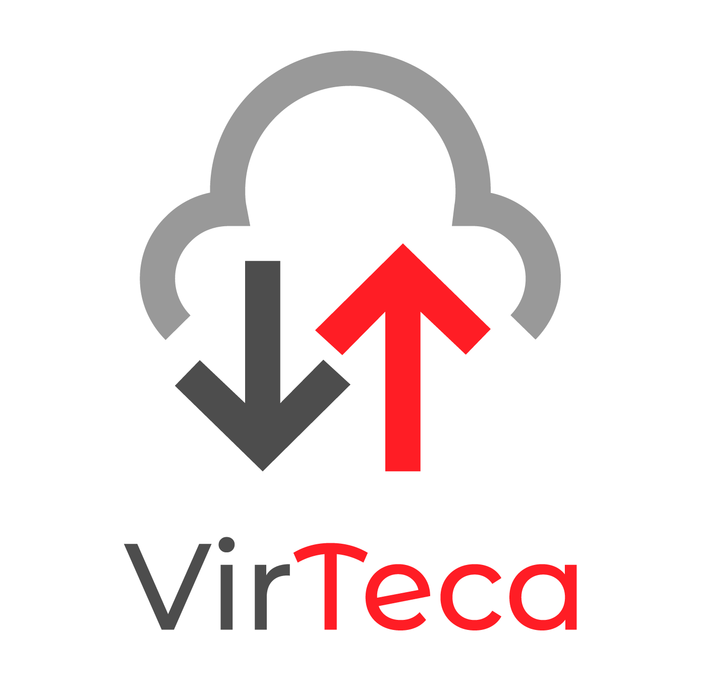
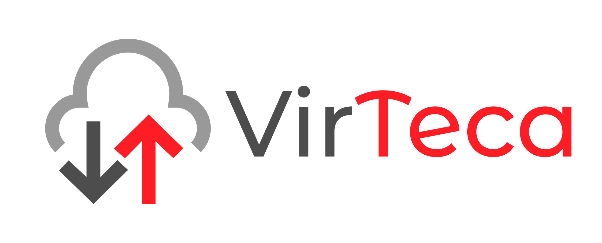

<h1 align="center">
  
</h1>

O VirTeca é um serviço de hospedagem de arquivos baseado em nuvem, que permite os usuários a armazenar ou consultar livros, filmes, softwares, músicas e outros arquivos no formato digital, através de dispositivos clientes Web ou Mobile. Os usuários também poderão se registrar através destas interfaces.

O método de armazenamento permite que um arquivo seja dividido em blocos usando uma convenção própria que inviabilizara a sua reconstrução por outros agentes leigos. Após a divisão, estes blocos são enviados a um ou mais servidores para a gravação em disco. Além disso, será mantida uma política de redundância para garantir disponibilidade dos dados em caso de falha em alguma instância de servidor.

Quando o dispositivo cliente solicitar o download do arquivo, o servidor recupera os blocos espalhados nas instâncias dos outros servidores para reconstruir arquivo que será devolvido.

Para armazenar arquivos o usuário deverá estar registrado e autenticado na aplicação.

<table border="0" >
    <tbody>
        <tr>
            <td colspan="2" align="center">
                
            </td>
        </tr>
        <tr>
            <th scope="row" align="right" width="260px">Categoria</th>
            <td align="left" valign="middle" width="650px">Serviço de hospedagem de arquivos</td>
        </tr>
        <tr>
            <th scope="row" align="right" width="260px">Cadastro</th>
            <td align="left" valign="middle" width="650px">Opcional</td>
        </tr>
        <tr>
            <th scope="row" align="right" width="260px">Início</th>
            <td align="left" valign="middle" width="650px">Outubro 2018</td>
        </tr>
        <tr>
            <th scope="row" align="right" width="260px">Colaboradores</th>
            <td align="left" valign="middle" width="650px">
                <a href="https://github.com/brenicio"><b>Brenicio</b></a>, <a href="https://github.com/danylo-macelai"><b>Danylo</b></a> e <a href="https://github.com/orenatoaraujo"><b>Renato</b></a>
            </td>
        </tr>
        <tr>
            <th scope="row" align="right" width="260px">Recursos</th>
            <td align="left" valign="middle" width="650px">
                Spring-Framework Boot Cloud, Hibernate, Eureka, Swagger, Msf4j, NodeJs, Grapqhl, Jwt, Sequelize, React, Android e etc...
            </td>
        </tr>
        <tr>
            <th scope="row" align="right" width="260px">Contribuições</th>
            <td align="left" valign="middle" width="650px">
                Veja <a href="../master/docs/CONTRIBUTING.md#como-contribuir"><b>aqui</b></a> os termos para as contribuições.
            </td>
        </tr>
        <tr>
            <th scope="row" align="right" width="260px">Configuração</th>
            <td align="left" valign="middle" width="650px">
                Veja <a href="../master/docs/ide.md#configuração-do-ambiente"><b>aqui</b></a> as configurações para desenvolvimento.
            </td>
        </tr>
        <tr>
            <th scope="row" align="right" width="260px">Licença</th>
            <td align="left" valign="middle" width="650px">
                ?????
            </td>
        </tr>
        <tr>
            <th scope="row" align="right" width="260px">Website</th>
            <td align="left" valign="middle" width="650px">virteca.com.br (Offline)</td>
        </tr>
    </tbody>

</table>

# História

No decorrer da especialização em [Desenvolvimento Web e Mobile - Full Stack](http://inf.ufg.br/espweb-mob) da [Universidade Federal de Goiás](https://www.ufg.br/) foi discutido alguns recursos tecnológicos conforme [ementa](https://docs.google.com/document/d/1QoNsiIL_b1FXZBbqHYIVFwHHTRKQwP1WCW3r_jXUSAw/edit).

Neste contexto surgiu o VirTeca como projeto, que pretendesse consolidar ao máximo a utilização destas práticas e recursos tecnológicos não só realizado a persistência de dados, más também a manipulação de binários e a troca de informações entre sistemas. Para isso dividimos nos módulos [virtual-common](/virtual-common/README.md), [virtual-master](/virtual-master/README.md), [virtual-slave](/virtual-slave/README.md), [virtual-access](/virtual-access/README.md), [virtual-web](/virtual-web/README.md) e [virtual-mobile](/virtual-mobile/README.md) responsáveis por tarefas específicas.

# Funcionalidade

Os módulos web e mobile refere-se ao lado do cliente, será as ferramentas utilizadas para os usuários terem acesso as funcionalidades dos demais módulos que possuem papeis, responsabilidades e ambientes diferentes.

O master atendera as solicitações de armazenamento, leitura e configurações relacionadas a arquivos já o access as operações com os usuários e controle de acesso.

O eureka é um serviço que permite os servidores slave se registem. Assim sempre que o master informar uma instanceId ele devolverá a sua respectiva homePageUrl.

O slave sempre que inicializado se auto registra no eureka para que através da sua instanceId possa atender as solicitações do master realizado a armazenamento, leitura, replicação ou ate mesmo a exclusão de blocos em disco.

    

Para o armazenamento de arquivos o usuário deve se autenticar no access para receber um token que deverá ser enviando junto com arquivo ao master. Antes de atender a requisição este token deverá ser validado no access para o prosseguimendo do processamento, que se inicializará com a divisão do arquivo em blocos de tamanho fixo conforme o definido nas configurações do master, para o seu envio imediato ao diretório temporário do master.

Uma tarefa será executada periodicamente para enviar estes blocos do diretório temporário do master para os servidores slave's registrados no eureka. Mantendo assim o instanceId para onde o bloco foi enviado para a gravação em disco.

Apos a gravação uma outra tarefa periodicamente será executada desta vez para replicar de acordo os blocos gravados de acordo com a quantidade de réplicas definidas nas configurações do master. Recuperando uma instanceId do eureka onde o tal bloco não existe e logo em seguida delegando ao slave que envie uma cópia do bloco para a tal instanceId.

Uma vez realizado todo este processo uma outra tarefa periodicamente será executada para apagar estes blocos que estão armazenados no diretório temporário do master para liberação do espaço em disco.

    

> _O arquivo Demonstrativo Financeiro.pdf está divido em tres blocos 1Z4A5Q.rvf, 2X6S7W.rvf e 3C8D9E.rvf. Cada bloco foi armazenado em locais diferentes o 1Z4A5Q.rvf está gravado no localhost:APP-SLAVE:8080 e replicado no localhost:APP-SLAVE:8083, já o bloco 2X6S7W.rvf no localhost:APP-SLAVE:8081 e localhost:APP-SLAVE:8080 e por último o 3C8D9E.rvf no localhost:APP-SLAVE:8082 e localhost:APP-SLAVE:8081._

Para ler o arquivo o usuário não precisará estar autenticado, basta informar o arquivo que servidor master buscará todas as instanceId independente de ser ou não réplicas dos blocos.

O master deverá recupera a homePageUrl da instanceId que esta ativa no eureka para realizar o download do bloco para o seu diretório temporário, repetindo assim esta atividade ate obter todos os blocos que serão necessários para reconstrução do arquivo.

A reconstrução do arquivo considera a mesma ordem em que os blocos foram divididos, colocando assim cada bloco em seu devido lugar ate gerar o arquivo final que será devolvido ao dispositivo cliente.

Uma vez finalizado este processo a mesma tarefa de limpeza citada no armazenamento ficará responsável de remover estes arquivos do diretório temporário.

    

Assim como o envio a edição ou até mesmo a exclusão só será permitida pelo o autor que foi previamente cadastrado no access. O Administrador do sistema poderá gerenciar todo o acervo bem como os usuários ou até mesmo as configurações do master e/ou slave.

Além das tarefas de gravação, replicação e limpeza do diretório outras também deverão ser executadas para manter as instancias slave ativas, migração dos blocos e as informações dos volumes.

# Crítica

A velocidade lenta da conexão de banda larga pode dificultar a transmissão de arquivos grandes, como filmes para dispositivos móveis e outros dispositivos remotos.

Somente o servidor Máster detêm o conhecimento lógico para reconstruir o arquivo.

Enquanto os blocos estão armazenados no Slave, esse conteúdo ainda está acessível aos usuários do VirTeca.
