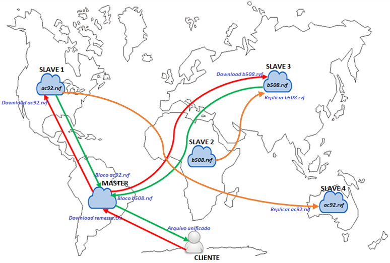

<h1 align="center">
  
</h1>

<h3 align="center">
	Gestão Distribuída de Arquivos
</h3>

  <strong>
    <a href="#virtual-common">Virtual Common</a> •
    <a href="#virtual-master">Virtual Master</a> •
    <a href="#virtual-slave">Virtual Slave</a> 
  </strong>

 O Repositório é um sistema de gerenciamento de arquivos que fornece uma interface de serviços para comunicação com os clientes permitindo a leitura, gravação e exclusão dos arquivos   que estão divididos em blocos de dados distribuídos entre os vários nós de armazenamento.

_O arquivo remessa.txt está divido em dois blocos ac92.rvf e b508.rvf. Cada bloco foi armazenado em locais diferentes o ac92.rvf está no Slave 1 e sua cópia no Slave 4, já o bloco b508.rvf no Slave 2 e 3._

Quando o cliente solicitar a leitura do arquivo o Master deverá recuperar os blocos nas instâncias dos Slaves e reconstruir arquivo que será devolvido ao cliente.

 
## Virtual Common

* O Common permite que os recursos sejam compartilhados com os demais projetos, fornecendo uma base para eles que combinam as soluções hibernate e spring.

## Virtual Master

* O Master é um micros-serviço que interage diretamente com os clientes através da leitura, gravação e exclusão de arquivos, os arquivos enviados serão divididos em blocos de tamanho fixo e replicados entres os vários nós Slave registrados no service discovery Eureka usado no Spring Cloud. Ao receber uma solicitação de leitura o Master recupera todos os blocos de arquivos inclusive as réplicas que estão espalhadas entre os diversos nós Slave inciando assim processo de reconstrução do arquivo que será devolvido ao cliente. Além disso mantém uma estratégia para migração de blocos e balanceamento de carga de cada Slave.

## Virtual Slave

* O Slave é um micros-serviço que utiliza [msf4j](https://github.com/wso2/msf4j) oferecendo uma interface rest para interagir exclusivamente com Master além de ser flexivelmente estendido, a cada inicialização ele se auto registra no service discovery permitindo assim que o Master sempre verifique a disponibilidade de suas instâncias.

>A versão utilizada do Eureka client tem a dependência jsr311-api que está em conflito com javax.ws.rs-api do msf4j infelizmente não é possível fazer a exclusão das dependências e contar que as bibliotecas continue fornecendo os serviços da forma esperada. Existe outras formas de contornar este problema, a que mais se adeqúo as necessidades foi trazer a classe org.wso2.msf4j.Response para dentro do projeto e realizar o ajuste necessário quando o método getMediaType() for invocado da javax.ws.rs.core.Response que não existe na versão jsr311-api e aguardar que  Eureka Client venha trabalhar algum dia com javax.ws.rs-ap não havendo assim a necessidade de se manter esta cópia ajustada dentro do projeto.

>Outro problema foi encontrado, desta vez dentro do msf4j-swagger na versão utilizada existe alguns relatos na issues, para resolver o problema foi utilizado a mesma abordagem acima.

## Requisitos Funcionais

* Executar uma instância Master e várias instâncias do Slave na plataforma de microsservos;

* O Master fornece interface REST para interagir com os usuários através do upload, download e exclusão de arquivos;

* O Slave não interage diretamente com os usuários;

* O Master divide o arquivo enviado pelo usuário em blocos de armazenamento de tamanho fixo, que é distribuído em os nós Slave. Cada bloco contém várias cópias.
 O tamanho do bloco e o número de cópias podem ser configurados através dos parâmetros do sistema;

* O serviço Slave pode ser flexivelmente estendido e, a cada vez que um serviço Slave é iniciado, ele pode ser descoberto e incorporado ao sistema Master;

* O Master é responsável por verificar o status de integridade de cada Slave. Quando o Slave está offline,o Master cópia (migra) automaticamente o bloco de dados originalmente salvo pelo serviço off-line;

* O Master deve implementar certas estratégias no processo de gerenciamento de armazenamento e migração de blocos de dados para manter o balanceamento de carga de cada Slave.
