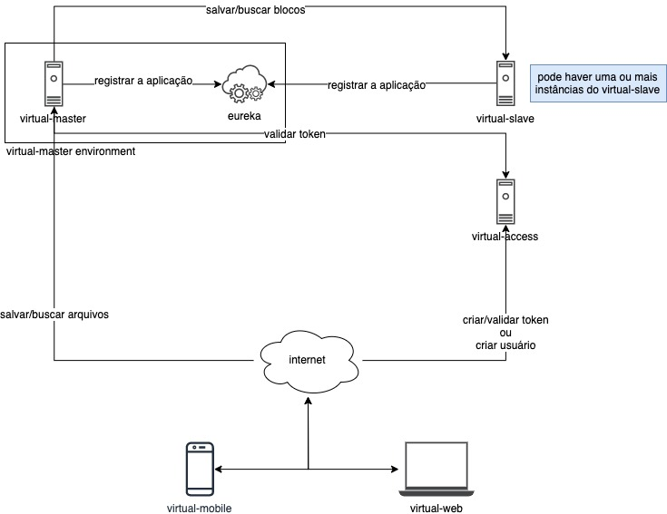

# Arquitetura Virteca

Como pode ser visto na imagem acima o Virteca é separado em 5 módulos:

- virtual-master
  - eureka
- virtual-slave
- virtual-access
- virtual-mobile
- virtual-web

No ambiente do virtual-master existe o eureka. O Eureka é uma ferramenta de terceiros utilizada para registrar e descobrir serviços.

A comunicação se inicia com os usuários que acessam o virtual-web ou instalam em seus dispositivos o virtual-mobile.

O usuário pode se registrar ou criar um token pelo virtual-access.

O usuário pode buscar ou salvar arquivos no virtual-master.

Os serviços de registrar a aplicação, salvar ou buscar blocos é feito internamente pela aplicação não é necessário a intermediação de um usuário, apenas do administrador da aplicação.
